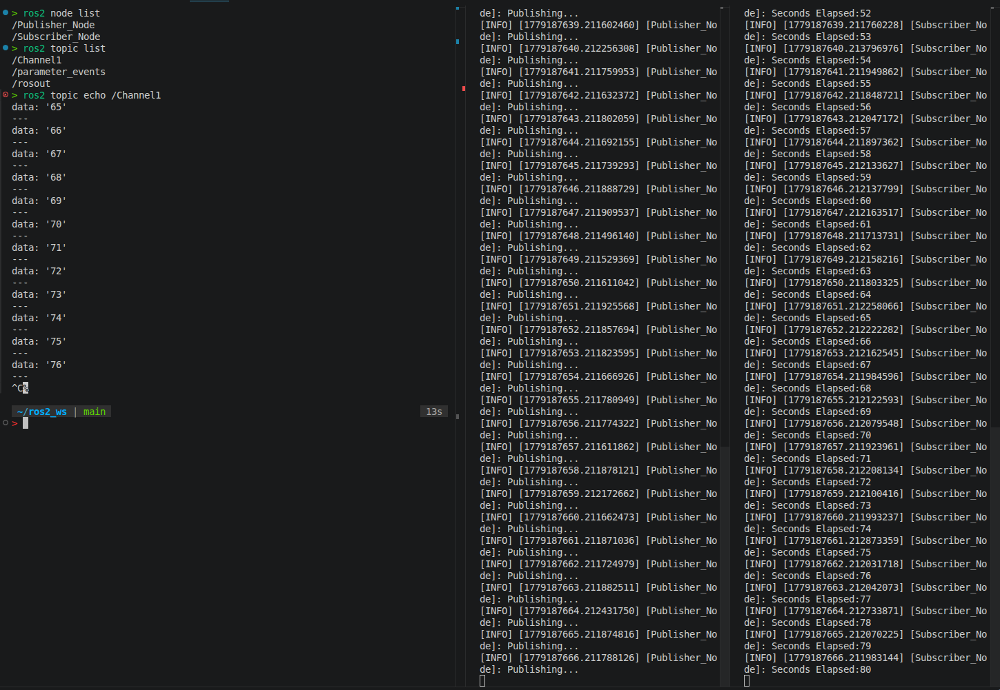
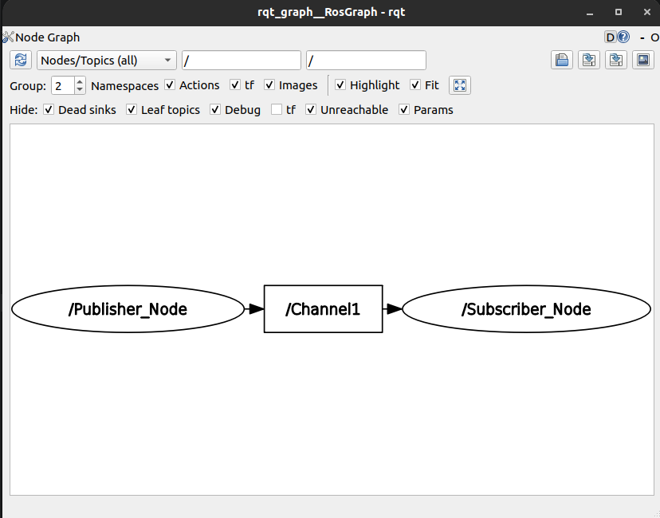
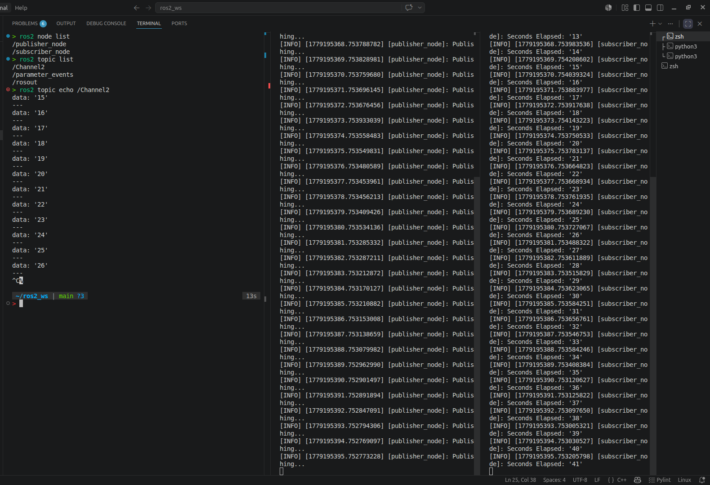
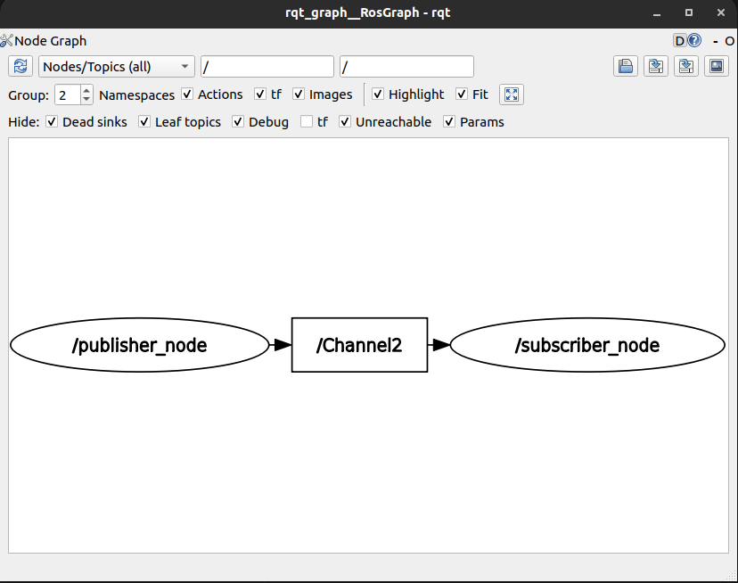
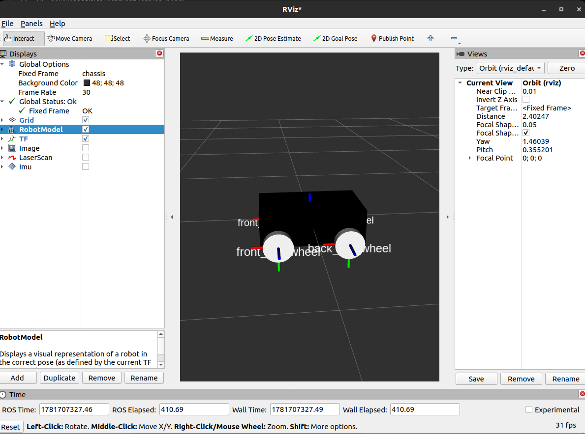
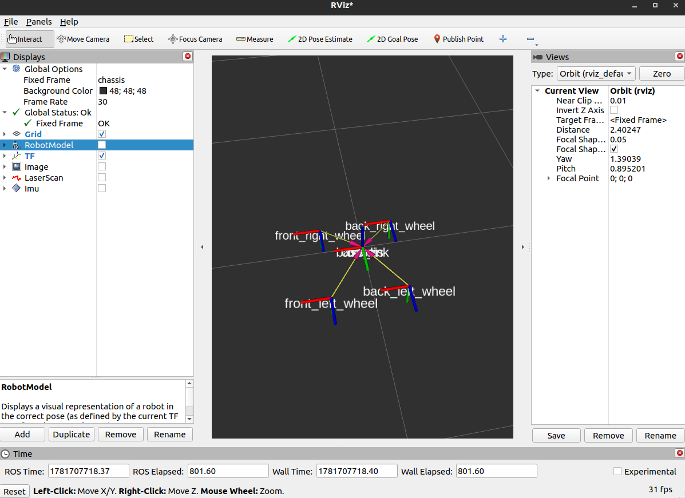
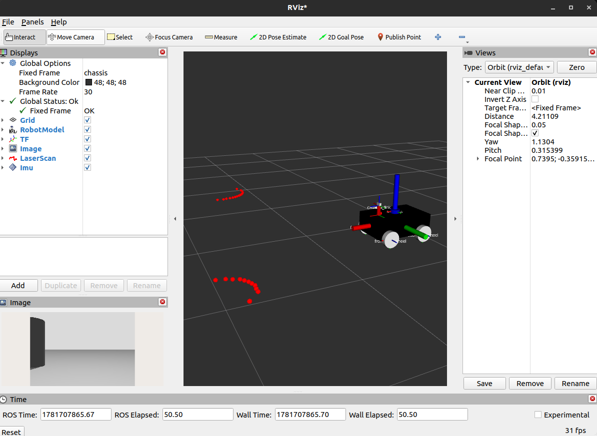
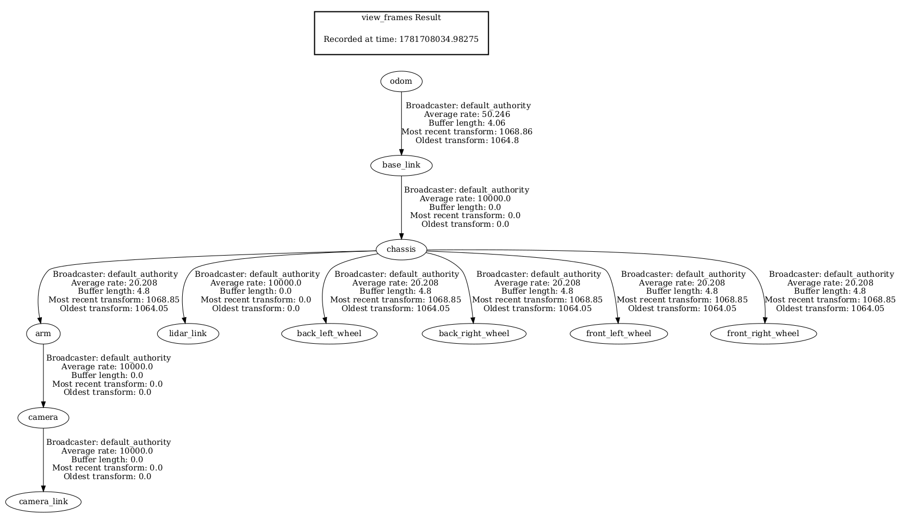
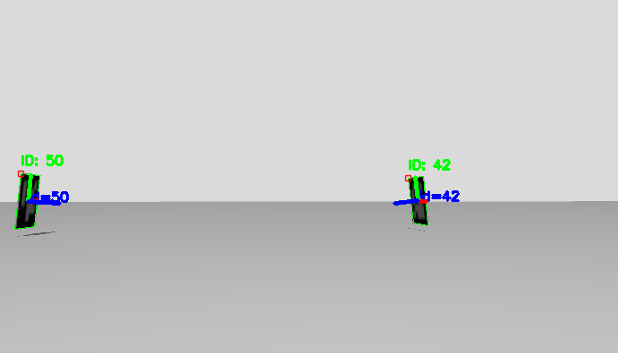
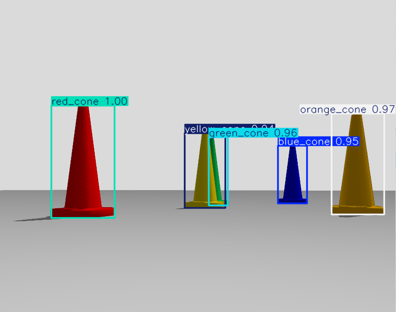

# MaRS Summer Tasks

## Task-1:

### What I Learned
* **Workspaces:** I learned how to create a ROS2 workspace (e.g., `~/ros2_ws/src`) to isolate project development.
* **Building & Sourcing:** I used  `colcon build` to compile the packages. I also learned the importance of overlaying the workspace onto the base ROS2 installation by sourcing the `install/setup.zsh` file, which allows my terminal to recognize my custom executables.
* **Package Creation:** I created a Python based package using `ament_python` and a C++ package (`cpp_pubsub`) using `ament_cmake`. I also learned that a package acts like a container which can be used as seperate modules for certain tasks.
* **Dependencies:** I learned `rosdep` to automatically check and install missing dependencies in the `package.xml`.
* **Configuration:** I configured the `setup.py` file to tell the system where my nodes' code is located so they can be executed from the CLI. I also learned how to link dependencies and compile source files into executable nodes by modifying `CMakeLists.txt` and understood how to configure the `install()` so the system knows where to find the compiled code so that it can be executed.
* **Publisher:** Wrote a `Publisher_Node` that continuously sends a string message over a specific topic (`/Channel1` and `/Channel2`).
* **Subscriber:** Wrote a `Subscriber_Node` that listens to the topic and uses a callback function to log the data it receives to the terminal.
* **Smart Pointers:** I learned how to initialize nodes and components using `std::make_shared` and `SharedPtr` to prevent memory leaks.
* **Const Usage:** I learned the importance of passing the message variables as const (`const std_msgs::msg::String &msg`) to protect data and save RAM.
* **String Version:** I also learned how to use `.c_str()` to connect current C++ strings with the logging functions (`RCLCPP_INFO`) since it is of older C-style.
---

### CLI Outputs & Visualization(Python)

I used the following ROS2 CLI tools:

*(Screenshot of the terminal running node/topic lists and topic echo)*


*(RQT Graph)*



### CLI Outputs & Visualization (C++ Nodes)

I used the following ROS2 CLI tools:

*(Screenshot of the terminal running node/topic lists and topic echo)*


*(RQT Graph)*



---

### How to Run the Nodes:
**1. Build the Workspace**

Before running any nodes, make sure the workspace is built and sourced:
```bash
cd ~/ros2_ws
colcon build --packages-select cpp_pubsub py_pubandsub
source install/setup.bash
```

***Running the Python Nodes:***

Open two separate terminal windows (ensure you run source install/setup.bash in both).

Terminal 1 (Publisher):
```bash
ros2 run py_pubandsub publisher
```
Terminal 2 (Subscriber):
```bash
ros2 run py_pubandsub subscriber
```

***Running the C++ Nodes:***

Similarly, open two separate sourced terminal windows.

Terminal 1 (Publisher):

```bash
ros2 run cpp_pubsub publisher
```
Terminal 2 (Subscriber):

```bash
ros2 run cpp_pubsub subscriber
```
---

## Task-2:
## Part 1: 

**1. Build and Source the Workspace**

Ensure the workspace is built and sourced:
```bash
cd ~/ros2_ws
colcon build --packages-select collision_avoidance
source install/setup.bash
```

**Subtask A: Auto-Avoidance & Launch Files**

To test the automatic wall avoidance, we use a launch file to start both the turtlesim environment and our custom control node simultaneously.

```bash
ros2 launch collision_avoidance launch.py
```

This single command triggers the launch script, which opens the blue Turtlesim window and starts the collision_avoidance_node. It also passes a default safety threshold parameter of 2.0 meters to the node.

***Modifying Parameters:***
You can dynamically change how close the turtle is allowed to get to the wall without stopping the program. Open a new terminal, source it, and run:

```bash
ros2 param set /collision_avoidance_node sfty_thd <new_parameter_value>
```

**Subtask B: Circular Patrol (Action Server & Client)**

Open two separate terminal windows (source both).

Terminal 1 (Start the Server):

```bash
ros2 run collision_avoidance circle_patrol_server
```

This starts the Action Server in the background. It will wait patiently for a goal request to arrive.

Terminal 2 (Send the Goal via Client):

```bash
ros2 run collision_avoidance circle_patrol_client <radius_value>
```

This command runs the Action Client and passes the radius as a command-line argument. The client sends a goal to the server requesting a circle with the specified radius. You will see real-time distance feedback print in this terminal until the circle is complete (or aborted due to a wall collision).


## Part 2: Deep Dive into the Communication Layer

### A. ROS 1 vs ROS 2 Architectural Shift

**1.**
In ROS 1, the network depended on a centralized registry called the ROS Master. Every node that booted up had to first register with the Master to share its location and discover other nodes. This made initial handshaking simple, but it created a **Single Point of Failure (SPOF)**. If the machine running `roscore` crashed, or lost WiFi connection, the entire robotic system paralyzed. Existing nodes could sometimes continue talking, but no new nodes could join, and if a connection stopped it couldnt be reestablished.

**2. Decentralization in ROS 2**
ROS 2 eliminates the centralized Master in favor of a peer-to-peer decentralized architecture. It adopts an industry-standard middleware known as Data Distribution Service (DDS). In ROS 2, nodes are entirely self-sufficient. They rely on distributed discovery mechanisms to find each other directly across a network, meaning there is no central broker that can crash and take down the robot.

**3. Data Transport: TCPROS/UDPROS vs. DDS Wire Protocol**
* **ROS 1 (TCPROS / UDPROS):** ROS 1 utilized custom, ROS-specific transport protocols. TCPROS was the default for reliable, stream-based data, while UDPROS was used for faster, best-effort data (like video feeds). Because these were custom-built for ROS, they lacked advanced networking capabilities and struggled with complex, lossy WiFi environments.
* **ROS 2 (DDS Wire Protocol / RTPS):** ROS 2 replaces these custom protocols with the Real-Time Publish Subscribe (RTPS) wire protocol, the underlying standard of DDS. RTPS sits on top of standard UDP and provides its own highly tunable Quality of Service (QoS) profiles, ensuring secure, real-time, and reliable data delivery without needing TCP.

### B. DDS (Data Distribution Service)

**1. The Discoverability Mechanism (SDP & Multicast UDP)**
To allow two ROS 2 nodes on separate laptops to find each other over the same Wi-Fi network without a central server, DDS utilizes the **Simple Discovery Protocol (SDP)**. 
When a new ROS 2 node boots up, it automatically sends out a "shout" to the local network using **Multicast UDP**. Instead of sending a message to a specific IP address, multicast sends the message to a designated shared channel that all ROS 2 nodes actively listen to. When existing nodes hear this multicast shout, they identify the new node, exchange connection details, and establish a direct peer-to-peer connection to begin sharing topic data.

**2. DDS Vendors and Configuration**
Three major DDS vendors integrated into ROS 2 include:
* **eProsima Fast DDS** *export RMW_IMPLEMENTATION=rmw_fastrtps_cpp*
* **Eclipse Cyclone DDS** *export RMW_IMPLEMENTATION=rmw_cyclonedds_cpp*
* **RTI Connext DDS** *export RMW_IMPLEMENTATION=rmw_connextdds*

## Task-3:

*(Rviz2 Simulation)*



*(TF Tree)*



---

## Task 4:

*(Sensor Vizualisation)*



*(Full TF Tree)*




### 🚀 How to Run the Simulation

**1. Launch the Physics Engine and Robot and Visualize the Sensor Data:**
Open a sourced terminal and run the main launch file. This starts Gazebo, spawns the URDF, and activates all sensor bridges and hardware controllers and launches RViz2 to see the robot's real-time TF Tree, Lidar scans, IMU vectors, and live Camera feed.

```bash
ros2 launch robotsim robo.launch.py
```

**3. Actuate the Hardware (Drive & Aim):**
To manually drive the robot using the diff_drive_controller, open a third terminal:

```bash
ros2 run teleop_twist_keyboard teleop_twist_keyboard --ros-args -r cmd_vel:=/diff_drive_controller/cmd_vel_unstamped
```

---


## 🚀 Task 5: Aruco Marker and YOLOv8 Cone Detection System

This package utilizes a custom-trained YOLOv8 Nano model to process live `/camera` feeds via OpenCV and detect colored cones in the Gazebo simulation.

### Execution Instructions

Open three separate terminal instances to run the system:

**1. Launch the Simulation Environment:**

```bash
cd ~/ros2_ws
source /opt/ros/humble/setup.zsh
ros2 launch robotsim robo.launch.py 
```

**2. Launch Teleop (Driver):**

```bash
cd ~/ros2_ws
source /opt/ros/humble/setup.zsh
ros2 run teleop_twist_keyboard teleop_twist_keyboard --ros-args -r cmd_vel:=/diff_drive_controller/cmd_vel_unstamped
```

*(Aruco Marker Detection)*

**3. Launch Aruco Detector Node:**
```bash
cd ~/ros2_ws/src/task3-5/robotsim/
source /opt/ros/humble/setup.zsh
python3 aruco_detector.py
```

*(Multiple Aruco Marker Detection)*



*(Coloured Cone Detection)*

**3. Launch YOLO Vision Node**
Ensure best.pt is located in the same directory as the script before executing.

```bash
cd ~/ros2_ws/src/task3-5/robotsim/
source /opt/ros/humble/setup.zsh
python3 cone_detector.py
```

*(Cone Detection)*



---